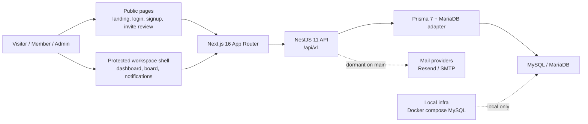
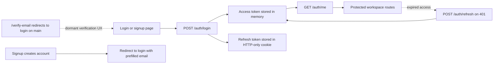
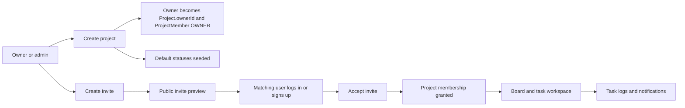
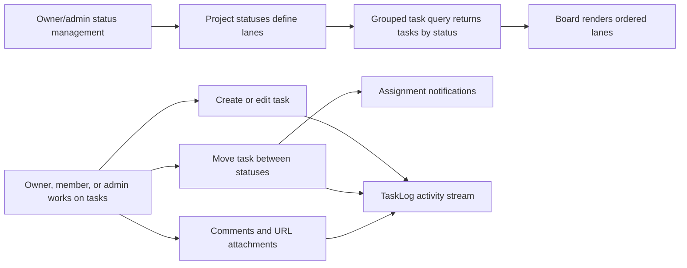
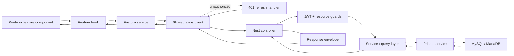
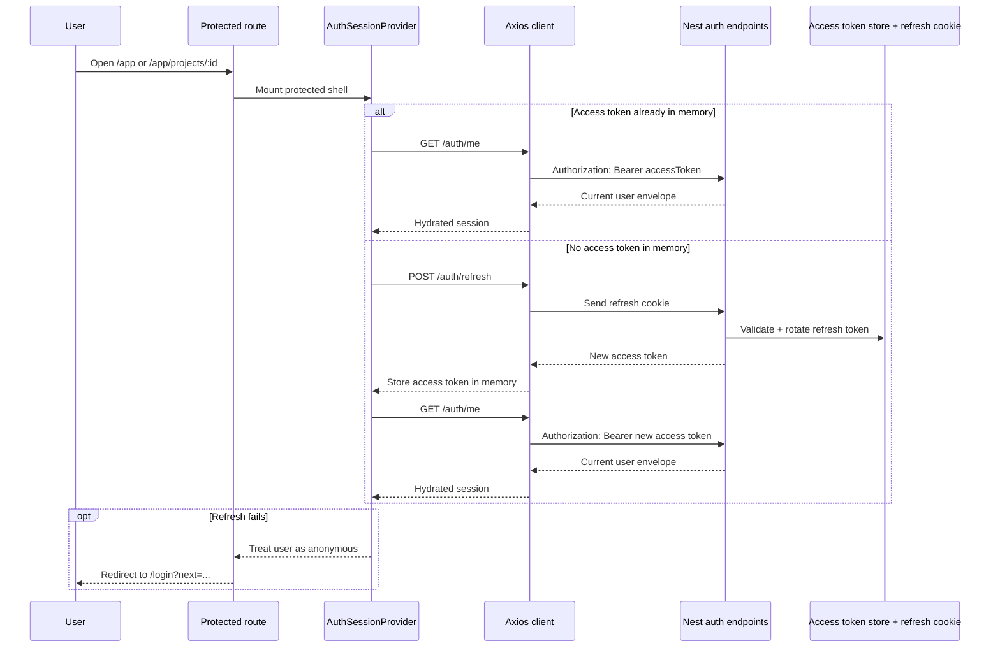
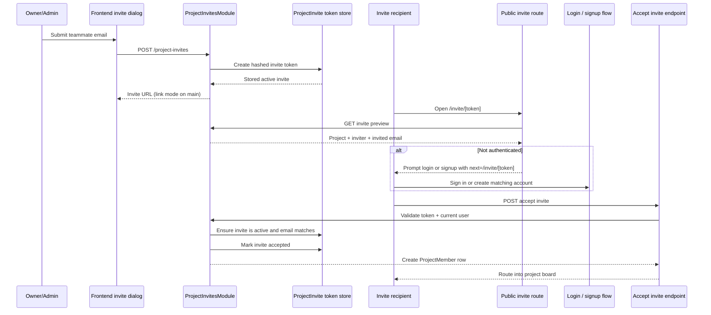
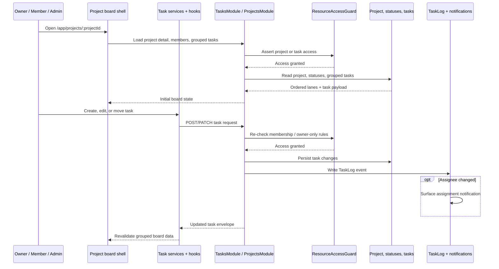
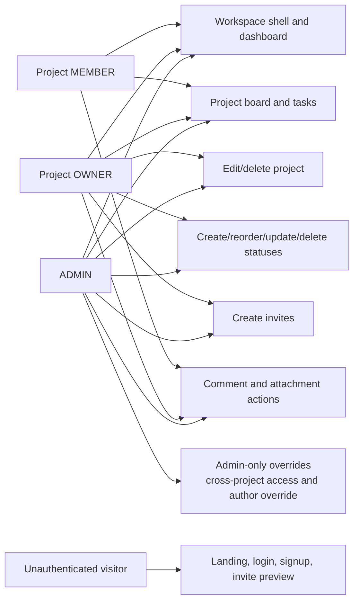

# Architecture Overview

This document describes the current `main` branch architecture of Archon as implemented in the repo.

## Monorepo Layout

Archon is a pnpm workspace monorepo:

```text
dowinn/
├── backend/   # NestJS API + Prisma schema/migrations
├── frontend/  # Next.js App Router client
├── infra/     # Local infrastructure assets, mainly Docker/MySQL
├── scripts/   # Workspace helper scripts
└── docs/      # Project documentation
```

The root workspace manages dependency installation and common commands:

- `pnpm dev`
- `pnpm build`
- `pnpm lint`
- `pnpm test`
- `pnpm typecheck`

## Visual Maps

### System architecture



### Auth and session flow



### Project collaboration flow



### Board and task workflow



## Detailed Interaction Maps

### Frontend-to-backend request lifecycle



### Auth bootstrap and session recovery



### Invite preview and acceptance journey



### Board load and task update lifecycle



### Role and permission boundary map



## Frontend Architecture

The frontend is a Next.js App Router application in `frontend/`.

### Route model

Public routes live under `src/app/(public)`:

- `/`
- `/login`
- `/signup`
- `/invite/[token]`
- `/verify-email`

Protected workspace routes live under `src/app/(app)/app`:

- `/app`
- `/app/projects/[projectId]`

The protected route group wraps its content with:

- `AuthSessionProvider`
- `ProtectedAppShell`
- `AppShellChrome`

### State and data flow

The frontend uses:

- React Query for request caching and mutations
- an axios client for API calls
- an in-memory access token store
- refresh-cookie recovery through `/auth/refresh`

Request flow:

1. UI components call feature hooks.
2. Hooks call service functions.
3. Service functions call the shared axios client.
4. The axios client attaches the in-memory access token when available.
5. On a `401`, the client can trigger the registered refresh handler.
6. The refresh handler calls `/auth/refresh`, stores the new access token, and retries the request.

The frontend never persists the access token to local storage. Session recovery depends on the refresh cookie plus the auth bootstrap query.

### UI architecture

Most frontend behavior is organized by feature:

- `features/auth`
- `features/projects`
- `features/project-board`
- `features/tasks`
- `features/notifications`

This keeps the route files thin and pushes business behavior into feature hooks and controllers.

## Backend Architecture

The backend is a NestJS application in `backend/`.

### Core module graph

The application module wires:

- `AuthModule`
- `HealthModule`
- `MailModule`
- `ProjectsModule`
- `ProjectInvitesModule`
- `SeedModule`
- `TaskLogsModule`
- `TasksModule`

It also loads environment validation and the Prisma database module.

### Global backend behaviors

`configureApplication` sets:

- global route prefix: `/api/v1`
- global validation pipe
- global response envelope interceptor
- global exception filter
- security-oriented response headers
- proxy trust configuration

The backend also installs request ID middleware globally.

### Response model

The API uses a consistent JSON envelope:

```json
{
  "success": true,
  "data": {},
  "meta": {},
  "error": null
}
```

Errors are normalized through the global exception filter.

### Swagger

Swagger is configured in `configure-swagger.ts`.

- UI path: `/api/v1/docs`
- JSON path: `/api/v1/docs-json`
- only mounted when `SWAGGER_ENABLED=true`

The current `main` branch intentionally hides the verify-email endpoints from Swagger, even though the backend routes still exist.

## Database Architecture

The backend uses Prisma 7 with:

- `@prisma/client`
- `@prisma/adapter-mariadb`
- a MySQL/MariaDB datasource

Main entities:

- `User`
- `RefreshToken`
- `EmailVerificationToken`
- `Project`
- `ProjectMember`
- `ProjectStatus`
- `Task`
- `TaskLog`
- `TaskLink`
- `TaskChecklistItem`
- `TaskComment`
- `TaskAttachment`
- `ProjectInvite`

### Key modeling decisions

- app-level role lives on `User.role`
- project role lives on `ProjectMember.role`
- project owner is stored separately on `Project.ownerId`
- task access is inferred from project access, not stored independently
- invite acceptance is email-bound
- invite tokens and email verification tokens are stored as hashes, not raw tokens

## Authorization Model

Authorization is centralized through the auth resource access system.

### Project access

`ResourceAuthorizationService.assertProjectAccess` allows:

- admins
- project owners
- project members for non-owner-only routes

Owner-only routes deliberately do not fall back to membership checks.

### Task access

`ResourceAuthorizationService.assertTaskAccess` allows:

- admins
- project owners
- project members with membership in the task's project

This means task permissions are inherited from project membership.

### Ownership-specific restrictions outside the main guard

Some actions add narrower service-level restrictions:

- task comments can only be updated/deleted by the comment author or an admin
- task attachments can only be deleted by the attachment creator or an admin

## Current Auth and Invite Defaults On `main`

The `main` branch runtime defaults are:

- `EMAIL_VERIFICATION_MODE=bypass`
- `INVITE_DELIVERY_MODE=link`

Implications:

- signup completes without requiring frontend verification UX
- `/verify-email` redirects to login
- invite creation returns a direct link by default
- the backend mail and verification infrastructure remains available but dormant unless explicitly re-enabled by env

The diagrams above reflect the `main` branch defaults, not the alternate `main-email` branch.
